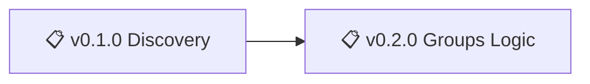

# Nonlinear Studio - Changelog

> 🤖
> This project follows [backstage protocol](https://github.com/nonlinear/backstage) v0.1.0
>
> - [README](../README.md) 👏 [ROADMAP](ROADMAP.md) 👏 [CHANGELOG](CHANGELOG.md) 👏 checks: [local](checks/local/) 0, [global](checks/global/) 28
>
> 🤖

---

## Latest

Nothing shipped yet. Check [ROADMAP](ROADMAP.md) for active epics.
