```mermaid
graph LR
    A[📋 v0.1.0 Foundation]
    B[📋 v0.2.0 Content]
    C[📋 v0.3.0 Features]
    A --> B
    B --> C
```

# Nonlinear Studio - Roadmap

> 🤖
> This project follows [backstage protocol](https://github.com/nonlinear/backstage) v0.1.0
>
> - [README](../README.md) 👏 [ROADMAP](ROADMAP.md) 👏 [CHANGELOG](CHANGELOG.md) 👏 checks: [local](checks/local/) 0, [global](checks/global/) 28
>
> 🤖

---

## v0.1.0 | [notes](epic-notes/v0.1.0-foundation.md)

### Foundation - Design & Deploy

**Goal:** Get the blog live with basic design and deploy pipeline

**Tasks:**

- [x] Hugo site structure (publishDir = docs)
- [x] Swup page transitions integration
- [x] SCSS setup (assets/scss/main.scss)
- [x] GitHub Pages configuration (main/docs)
- [x] Repository made public
- [ ] Basic navigation (home, about, posts)
- [ ] Typography & color system
- [ ] Responsive layout (mobile-first)
- [ ] Custom 404 page
- [ ] Deploy and verify live site

**Success:** Site live at https://nonlinear-studio.github.io with clean design

---

## v0.2.0

### Content - First Posts & About

**Goal:** Populate with initial content and establish writing workflow

**Tasks:**

- [ ] About page (who/what/why)
- [ ] First 3 posts (topics TBD)
- [ ] RSS feed configuration
- [ ] Post template/archetype
- [ ] Tags/categories structure
- [ ] Reading time estimate
- [ ] Social sharing meta tags

**Success:** 3+ posts published, RSS working, About page complete

---

## v0.3.0

### Features - Enhanced Reading Experience

**Goal:** Add features that make the blog more engaging

**Tasks:**

- [ ] Syntax highlighting for code blocks
- [ ] Table of contents (long posts)
- [ ] Previous/Next post navigation
- [ ] Search (lunr.js or similar)
- [ ] Dark mode toggle
- [ ] Image optimization pipeline
- [ ] Comments (optional - self-hosted?)

**Success:** Enhanced UX, reader-friendly features

---
