```mermaid
graph LR
    A[📋 v0.1.0 Discovery]
    B[📋 v0.2.0 Groups Logic]
    A --> B
```

# Nonlinear Studio - Roadmap

> 🤖
> This project follows [backstage protocol](https://github.com/nonlinear/backstage) v0.1.0
>
> - [README](../README.md) 👏 [ROADMAP](ROADMAP.md) 👏 [CHANGELOG](CHANGELOG.md) 👏 checks: [local](checks/local/) 0, [global](checks/global/) 28
>
> 🤖

---

## v0.1.0 | [notes](epic-notes/v0.1.0-discovery.md)

### Discovery

**Goal:** Define mental model and establish visual identity

**Tasks:**

- [ ] List critical user flows
- [ ] User flow exercise
- [ ] Get actionables from user flows
- [ ] Discuss deliverables (can we use Hugo? can it BECOME the site?)
- [ ] Define mental model (core concepts, user flows, architecture)
- [ ] Logo design

**Details:** [v0.1.0-discovery.md](epic-notes/v0.1.0-discovery.md)

---

## v0.2.0

### Groups Logic (BeeKEM Protocol)

**Goal:** Research and implement group encryption/authorization for CRDTs

**Context:** BeeKEM protocol (Ink & Switch Keyhive project) - key encapsulation for group messaging in local-first apps

**Key Concepts:**
- **Keyhive:** Capability-based auth + sync for CRDTs
- **BeeKEM:** Key encapsulation mechanism for group encryption
- **Sedimentree:** Probabilistic compression of CRDT updates by DAG depth
- **Local-first:** Autonomy, privacy, consent (not just technical architecture)

**Problem:**
- CRDTs need end-to-end encryption without breaking batching optimizations
- Group collaboration = secure group messaging complexity
- Need distributed capability-based authorization (read/write/admin roles)

**Tasks:**
- [ ] Read BeeKEM protocol paper/spec
- [ ] Understand Keyhive architecture (delegation chains, capabilities)
- [ ] Understand Sedimentree (DAG depth-based compression)
- [ ] Evaluate fit for Nonlinear Studio use case
- [ ] Prototype or integrate (if applicable)

**Reference:** https://meri.garden/a-deep-dive-explainer-on-beekem-protocol/

**Success:**
- Clear understanding of BeeKEM vs alternatives
- Decision: implement, fork, or use different approach
- If implementing: prototype working with test CRDTs

---
