```mermaid
graph LR
    A[📋 v0.1.0 Foundation]
    B[📋 v0.2.0 Content]
    C[📋 v0.3.0 Features]
    A --> B
    B --> C
```

# Nonlinear Studio - Roadmap

> 🤖
> This project follows [backstage protocol](https://github.com/nonlinear/backstage) v0.1.0
>
> - [README](../README.md) 👠[ROADMAP](ROADMAP.md) 👠[CHANGELOG](CHANGELOG.md) 👠checks: [local](checks/local/) 0, [global](checks/global/) 28
>
> 🤖

---

## v0.1.0

### Foundation

**Goal:** Get the blog live with basic design and deploy pipeline

**Tasks:**

- [ ] basic structure
- [ ] o que vai na pagina inicial?
- [ ] artigos pra cada projeto
- [ ] definir frontmatter de cada (checks)
- [ ] check if link works

---
