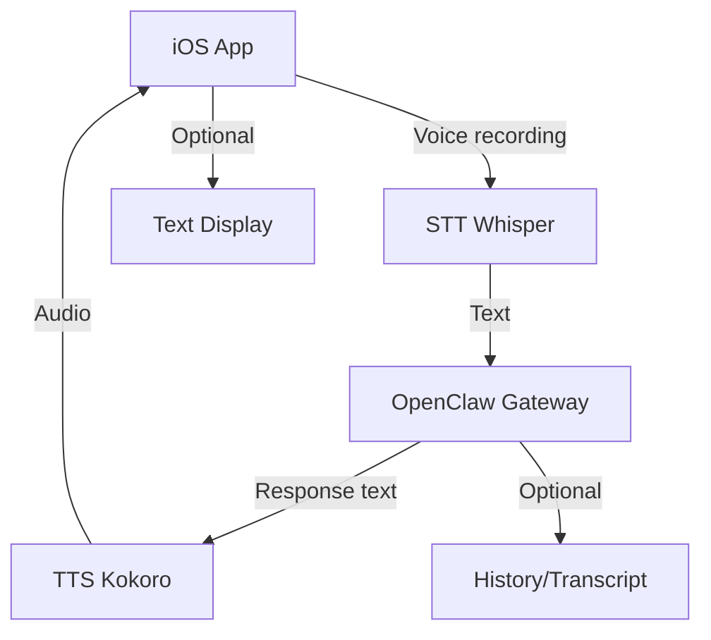
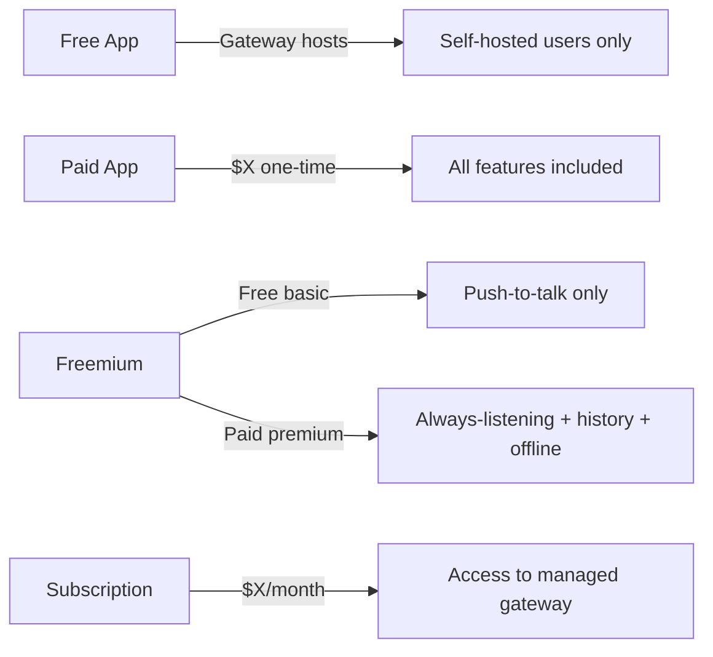
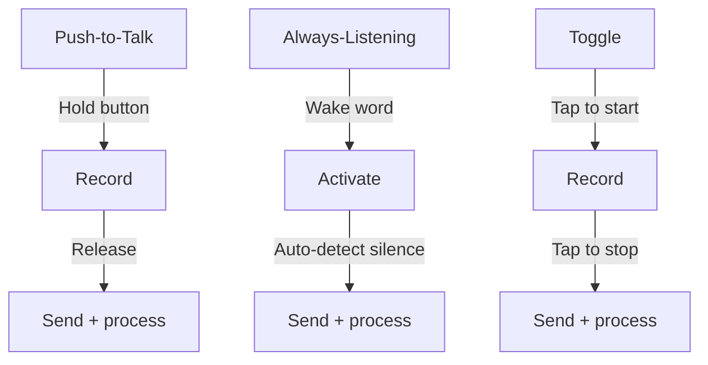

# v0.14.0 - OpenClaw Walkie-Talkie

**Created:** 2026-02-15  
**Status:** Planning  
**Epic type:** New iOS app (potential revenue stream)

---

## Context Snapshot

**Why this exists:**  
Voice-first AI interaction for OpenClaw. iOS app where you TALK to your AI instead of typing. Potential paid app or freemium model.

**Problem solved:**  
Current OpenClaw = desktop/web-centric, typing required. Mobile voice = faster, hands-free, more natural interaction (especially for two-spirit/neurodivergent users who think better by talking).

**Date:** 2026-02-15  
**Assumptions:**  
- OpenClaw has voice capabilities (STT/TTS) via Whisper + Kokoro (self-hosted stack)
- iOS app can connect to gateway via API
- Push-to-talk OR always-listening modes supported
- Monetization TBD (one-time purchase? subscription? freemium?)

---

## Goal

Build iOS voice-first app for OpenClaw. Talk to your AI like a walkie-talkie. Ship v1.0 with core functionality, iterate based on usage.

---

## Questions for Nicholas (Disambiguation Protocol)

**To work unsupervised, I need answers to:**

### 1. **Monetization Model**
- [ ] Free app (gateway pays for hosting)?
- [ ] One-time purchase ($X)?
- [ ] Subscription ($X/month)?
- [ ] Freemium (free basic, paid premium features)?
- [ ] Which features are free vs paid (if freemium)?

### 2. **Voice Interaction Mode**
- [ ] Push-to-talk (hold button, release to send)?
- [ ] Always-listening (wake word like "Hey Claw")?
- [ ] Toggle mode (tap to start recording, tap to stop)?
- [ ] All three (user preference)?

### 3. **Gateway Connection**
- [ ] Connect to user's self-hosted gateway (user provides URL + token)?
- [ ] Connect to shared/managed gateway (we host, charge for access)?
- [ ] Hybrid (can connect to either)?

### 4. **iOS App Scope (v1.0)**
Which features are IN SCOPE for first version?
- [ ] Voice recording + playback
- [ ] Text display of conversation (backup/accessibility)
- [ ] History/transcript view
- [ ] Offline queue (send when online)
- [ ] Multiple gateway profiles (switch between work/personal)
- [ ] Background mode (receive responses while app closed)
- [ ] Widget support (quick access from home screen)
- [ ] CarPlay integration (hands-free while driving)
- [ ] Shortcuts app integration (Siri triggers)

### 5. **Design/UX Reference**
Any existing apps you want to model this after?
- [ ] Walkie-talkie apps (Zello, Voxer)?
- [ ] Voice assistant apps (ChatGPT voice mode, Alexa)?
- [ ] Messaging apps with voice (Telegram voice messages)?
- [ ] Other reference? (provide name/screenshots)

### 6. **Technical Stack**
- [ ] Native Swift + SwiftUI?
- [ ] React Native (cross-platform iOS + Android)?
- [ ] Flutter (if we want Android later)?
- [ ] Which OpenClaw API endpoints will this use? (need API docs)

### 7. **Launch Strategy**
- [ ] TestFlight beta first (invite-only)?
- [ ] Public TestFlight (anyone can test)?
- [ ] Straight to App Store?
- [ ] Soft launch (limited countries)?

### 8. **Name**
- [ ] "OpenClaw Walkie-Talkie"?
- [ ] "Claw Voice"?
- [ ] "Walkie" (simple)?
- [ ] Other? (suggest alternatives)

### 9. **Branding**
- [ ] Use OpenClaw logo/colors?
- [ ] Separate brand identity?
- [ ] Minimalist/anarchist aesthetic (black/white, no bullshit)?

### 10. **Who Builds This?**
- [ ] You (Nicholas) code it?
- [ ] Me (Kin) design/spec, you implement?
- [ ] Hire iOS dev?
- [ ] Contract out full build?

---

## Proposed Architecture (Pending Answers)

**Diagram 1: High-Level Flow**

**Diagram 2: Monetization Models (Options)**

**Diagram 3: Voice Interaction Modes**

---

## Tasks (Blocked Until Disambiguation)

**Phase 1: Planning**
- [ ] Answer all 10 disambiguation questions above
- [ ] Create UX wireframes (low-fi sketches)
- [ ] Research iOS voice app best practices (App Store guidelines, privacy, permissions)
- [ ] Define API contract (which OpenClaw endpoints needed)
- [ ] Choose tech stack (Swift vs React Native vs Flutter)

**Phase 2: Design**
- [ ] High-fi mockups (Figma or Sketch)
- [ ] Define color palette + typography
- [ ] Icon design (App Store + in-app)
- [ ] Prototype interaction flow (InVision or Figma prototype)

**Phase 3: Development**
- [ ] Set up iOS project (Xcode + repo)
- [ ] Implement voice recording (AVFoundation)
- [ ] Implement STT integration (Whisper API or self-hosted)
- [ ] Implement TTS playback (Kokoro API or self-hosted)
- [ ] Implement gateway connection (API client)
- [ ] Implement conversation history (local storage)
- [ ] Implement offline queue (if in scope)
- [ ] Implement background mode (if in scope)
- [ ] Implement widgets (if in scope)
- [ ] Implement CarPlay (if in scope)

**Phase 4: Testing**
- [ ] Internal testing (dogfooding)
- [ ] TestFlight beta (invite-only or public)
- [ ] Bug fixes + iteration
- [ ] Performance optimization (battery, network usage)
- [ ] Accessibility testing (VoiceOver, Dynamic Type)

**Phase 5: Launch**
- [ ] App Store submission (metadata, screenshots, description)
- [ ] App Store review (respond to feedback)
- [ ] Launch announcement (social media, blog post)
- [ ] Monitor crash reports + user feedback

**Phase 6: Iteration**
- [ ] Analyze usage patterns
- [ ] Prioritize feature requests
- [ ] Ship v1.1, v1.2, etc.

---

## Risks & Caveats

**Technical:**
- iOS voice permissions = users might deny access (UX handles gracefully)
- Background mode = App Store review scrutiny (need clear use case)
- Battery usage = voice processing + network = drain (optimize)

**Monetization:**
- If paid app = discovery problem (need marketing)
- If freemium = need compelling premium features (avoid "pay to use basic functionality")
- If subscription = churn risk (must provide ongoing value)

**Market:**
- Voice AI apps = crowded space (ChatGPT, Gemini, Perplexity all have voice)
- Differentiation = OpenClaw's autonomy + self-hosted option + anarchist ethos

**Legal:**
- App Store guidelines = no cryptocurrency mining, no NSFW, no violence
- Privacy policy = required for voice recording (even if local-only)
- Terms of service = required for gateway connection

---

## Success Metrics (TBD)

**v1.0 Launch Goals:**
- [ ] X downloads in first month
- [ ] X daily active users
- [ ] X% retention after 7 days
- [ ] X average session length
- [ ] X revenue (if paid/subscription)

---

## Related Epics

- **nonlinear v0.11.0** - Memory Architecture (backend for conversation history)
- **personal v0.18.0** - Open Source Notes (SiYuan mobile UX research transferable)
- **apps v0.3.0** - Webchat Redesign (design patterns transferable)

---

## Notes

**Nicholas's request:** "an ios app wher you can TALK to your AI. maybe charge."

**My interpretation:** Voice-first mobile experience. Monetization TBD (one-time vs subscription vs freemium).

**Disambiguation strategy:** 10 questions above = minimum info needed to design/build unsupervised.

**Next step:** Nicholas answers questions → I create detailed spec + wireframes + mermaid diagrams → handoff to dev (Nicholas or contractor).

---

**Status:** ⏸️ PAUSED (awaiting disambiguation answers)
